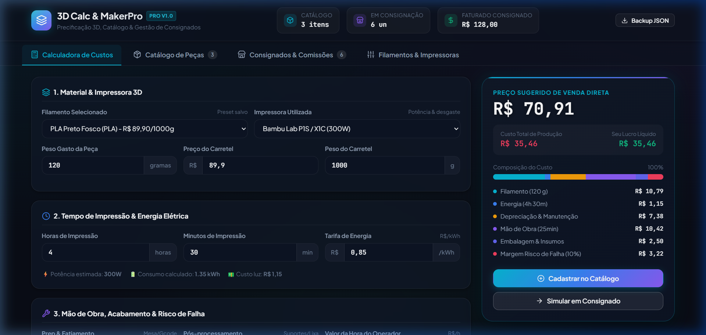
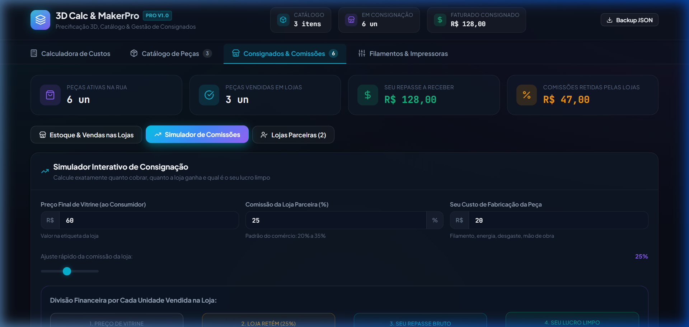
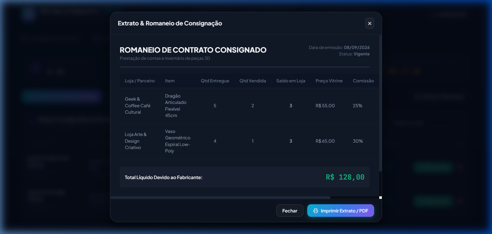

<div align="center">

# 🖨️ 3D Calc & MakerPro
### Sistema Profissional de Precificação 3D, Catálogo de Peças & Gestão de Consignados


<p align="center">
  <b>Precifique suas impressões 3D com precisão cirúrgica, catalogue suas peças e controle estoques e comissões em pontos de venda parceiros.</b>
</p>

[Funcionalidades](#-funcionalidades-principais) • [Demonstração Visual](#-demonstração-visual) • [Deploy no EasyPanel](#-deploy-no-easypanel-sua-vps) • [Como Rodar Local](#-como-rodar-localmente) • [Tecnologias](#-tecnologias)

</div>

---

## 💡 O Problema que este Projeto Resolve

Muitos makers e estúdios de impressão 3D precificam peças no "olhômetro" ou multiplicando apenas o peso do filamento, esquecendo fatores críticos que corroem o lucro:
- Custo real de **energia elétrica** (kWh por tempo de máquina ligado).
- **Desgaste da impressora**, bicos e manutenções preventivas.
- **Mão de obra** gasta fatiando, preparando a mesa e removendo suportes.
- **Margem de risco** para impressões que falham.
- **Comissões de lojas consignadas**: vender em lojas físicas e cafeterias sem calcular o repasse líquido exato pode gerar prejuízo silencioso.

O **3D Calc & MakerPro** unifica toda essa inteligência em uma interface moderna, rápida e responsiva.

---

## 🚀 Funcionalidades Principais

### 1. 🧮 Calculadora de Custos & Formação de Preço
- **Consumo de Filamento:** Preço por grama calculado dinamicamente pelo peso da peça e valor do carretel.
- **Energia Elétrica:** Cálculo de consumo em kWh cruzando potência (Watts), tempo de impressão e tarifa (R$/kWh).
- **Desgaste & Depreciação:** Amortização do valor da máquina pelas horas de vida útil + taxa de manutenção por hora.
- **Mão de Obra do Operador:** Fatiamento, preparação e pós-processamento (lixamento/acabamento) com valor/hora configurável.
- **Custos Extras & Embalagem:** Caixas, fitas, álcool isopropílico e brindes.
- **Margem de Risco de Falha:** Margem percentual para compensar impressões perdidas.
- **Lucro & Markup:** Ajuste de margem em tempo real com gráfico em barra da composição do custo.
- **Ação 1-Clique:** Botão *"Cadastrar no Catálogo"* para salvar a peça diretamente.

### 2. 📦 Catálogo de Produtos Criados
- Vitrine em cards com foto, especificações (material, peso gasto, tempo de máquina).
- Comparativo claro de **Custo de Fabricação vs. Preço de Venda**.
- **Controle de Estoque Ágil:** Botões `+` e `-` para atualizar quantidade para pronta-entrega.
- **Ficha Técnica Imprimível:** Layout formatado para impressão com foto e etiqueta de preço.
- **Despacho para Consignado:** Envie lotes direto do catálogo para lojas parceiras.

### 3. 🤝 Módulo de Consignação & Comissões
- **Simulador de Consignado:** Ajuste a comissão do lojista (ex: 20%, 25%, 30%) e veja:
  - Preço de vitrine pago pelo consumidor final;
  - Valor retido pela loja parceira;
  - Repasse líquido a você;
  - Seu lucro limpo final após descontar os custos de produção.
- **Gestão de Remessas:** Acompanhamento de peças entregues, vendidas, saldo em prateleira e valor a receber.
- **Baixa Rápida de Vendas:** Registre vendas informadas pelos parceiros com 1 clique.
- **Extrato & Romaneio:** Emissão de romaneio de entrega com campos para assinaturas do fabricante e lojista.

### 4. ⚙️ Gestão de Recursos & Backup
- Cadastro de múltiplas **impressoras** (potência em W, valor de compra, vida útil).
- Estoque de **carretéis de filamento** (marcas, materiais PLA/PETG/ABS/TPU e cores).
- **Exportação/Importação JSON:** Backup completo com um clique para nunca perder dados.

---

## 📸 Demonstração Visual

### 1. Calculadora de Custos e Formação de Preço
Cálculo detalhado com divisão visual de filamento, energia, depreciação, mão de obra e lucro:
<p align="center">
  
</p>

### 2. Catálogo de Peças Criadas
Organização visual dos modelos com especificações técnicas e ajuste rápido de estoque:
<p align="center">
  
</p>

### 3. Simulador de Consignação & Comissões
Simule a divisão financeira entre o preço de prateleira, comissão da loja e seu lucro líquido:
<p align="center">
  
</p>

### 4. Romaneio e Extrato de Prestação de Contas
Documento formal para impressão e assinatura de entrega em lojas parceiras:
<p align="center">
  
</p>

---

## 🐳 Deploy no EasyPanel (Sua VPS)

O repositório já inclui um **`Dockerfile` multi-stage com Nginx Alpine** super otimizado (consome menos de 25MB de RAM).

### Passo a Passo:

1. Faça push deste repositório para o seu Git (GitHub / GitLab / Gitea).
2. No painel do seu **EasyPanel**:
   - Vá no seu Projeto e clique em **+ Project Service** ➔ **App**.
   - Dê um nome (ex: `calculadora-3d`).
3. Em **Source**:
   - Conecte ao seu repositório Git e selecione o branch (`main`).
4. Em **Build**:
   - Selecione o método **Dockerfile** (ele detectará o arquivo na raiz).
5. Em **Ports**:
   - Porta: **`80`**.
6. Em **Domains**:
   - Informe seu subdomínio (ex: `3d.seudominio.com`). O EasyPanel emite o certificado SSL (HTTPS) automaticamente.
7. Clique em **Deploy**.

> 💡 **Dica Mobile:** Ao acessar pelo celular no navegador (Chrome ou Safari), toque em *"Adicionar à tela de início"* para utilizar o sistema como um app nativo em tela cheia!

---

## 💻 Como Rodar Localmente

### Pré-requisitos
- Node.js 18+ instalado

```bash
# 1. Clone o repositório
git clone https://github.com/seu-usuario/3dcalculate.git
cd 3dcalculate

# 2. Instale as dependências
npm install

# 3. Inicie o servidor de desenvolvimento
npm run dev
```

Acesse em: [http://localhost:5173](http://localhost:5173)

---

## 🛠 Tecnologias

- **Frontend:** [React 19](https://react.dev/) + [Vite](https://vitejs.dev/)
- **Estilização:** CSS Moderno (Design System Dark Industrial, Glassmorphism, Print Stylesheets)
- **Ícones:** [Lucide React](https://lucide.dev/)
- **Tipografia:** Google Fonts (Plus Jakarta Sans & JetBrains Mono)
- **Servidor de Produção:** Nginx Alpine com compressão Gzip
- **Deploy:** Docker & EasyPanel

---

## 📄 Licença

Distribuído sob a licença MIT. Veja `LICENSE` para mais detalhes.
